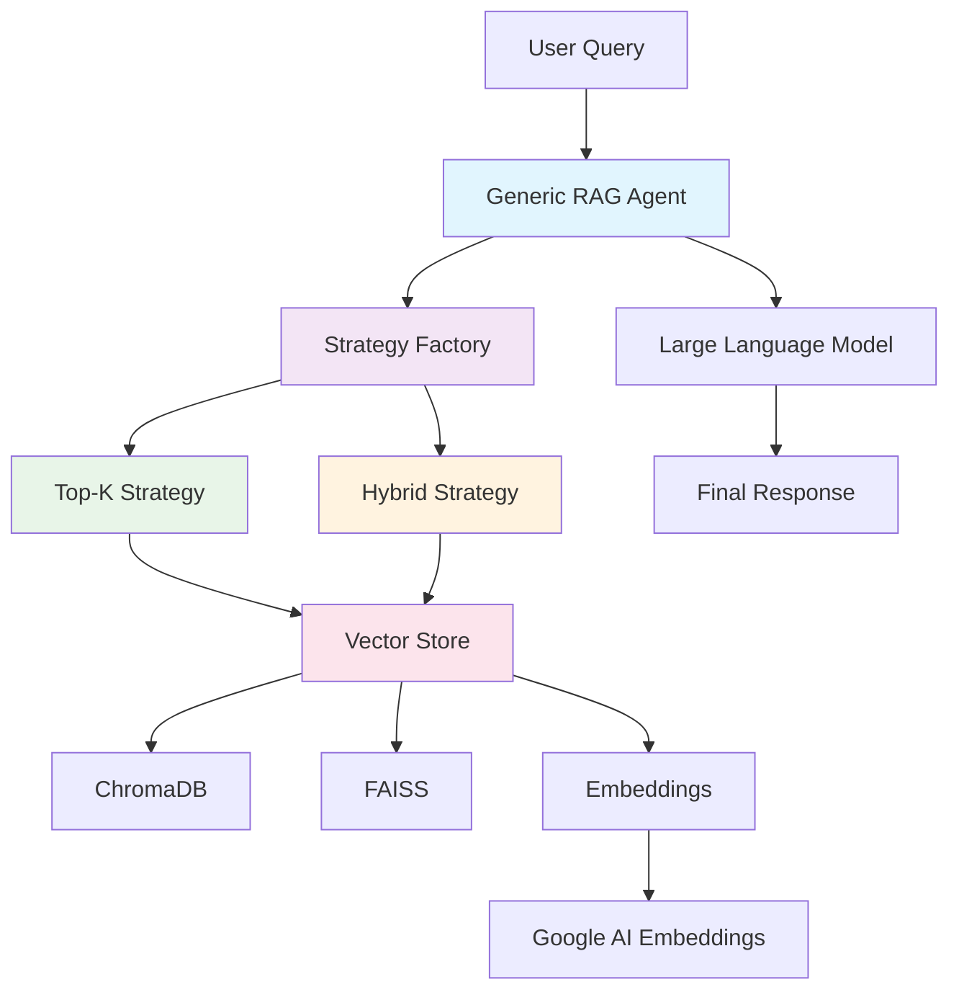
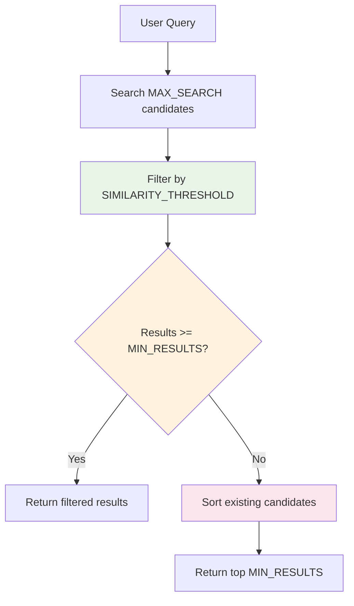
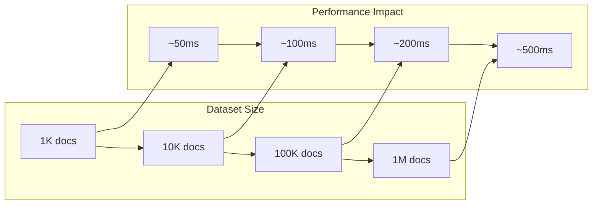
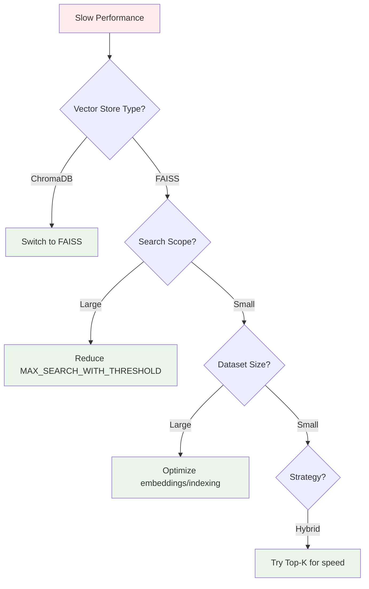

# RAG System Documentation

## 📋 Overview

This document provides comprehensive documentation for the Retrieval-Augmented Generation (RAG) system, including architecture, configuration, strategies, and usage examples.

## 🏗️ Architecture Overview

The RAG system uses a **Strategy Pattern** to provide flexible retrieval approaches. The system supports two main strategies:

1. **Top-K Strategy**: Traditional similarity search returning a fixed number of results
2. **Hybrid Strategy**: Quality-first approach with intelligent fallback mechanisms

### System Architecture Diagram



### File Structure

```
📁 core/rag/
├── 📁 config/
│   ├── rag_config.py          # RAG-specific configuration
│   └── strategy_config.py     # Strategy-specific settings
├── 📁 strategies/
│   ├── base_strategy.py       # Abstract strategy interface
│   ├── top_k_strategy.py      # Top-K implementation
│   ├── hybrid_strategy.py     # Hybrid implementation
│   └── strategy_factory.py    # Strategy creation
├── generic_rag_agent.py       # Main RAG agent (simplified)
├── generic_vector_store.py    # Vector store wrapper
└── vector_store_factory.py    # Vector store factory

📁 config/
└── base_config.py             # Simplified RAG configuration (5 lines)
```

## ⚙️ Configuration Guide

### RAG Configuration (config/base_config.py)

```python
# RAG Configuration
DEFAULT_RETRIEVAL_STRATEGY = "hybrid"  # Strategy: "top_k" (quantity) or "hybrid" (quality+quantity)
DEFAULT_TOP_K = 50                     # Number of results for top_k strategy
DEFAULT_SIMILARITY_THRESHOLD = 0.7     # Minimum similarity score (0.0-1.0) for quality filtering
DEFAULT_MAX_SEARCH_WITH_THRESHOLD = 100 # Max candidates to search before filtering
DEFAULT_MIN_RESULTS_WITH_THRESHOLD = 1  # Minimum results to return (safety net)
```

### Configuration Parameters Explained

| Parameter | Purpose | Default | Range | Strategy Usage |
|-----------|---------|---------|-------|----------------|
| `RETRIEVAL_STRATEGY` | Controls retrieval approach | `"hybrid"` | `"top_k"`, `"hybrid"` | Both |
| `TOP_K` | Fixed number of results | `50` | 1-1000 | Top-K only |
| `SIMILARITY_THRESHOLD` | Quality filter threshold | `0.7` | 0.0-1.0 | Hybrid only |
| `MAX_SEARCH_WITH_THRESHOLD` | Search scope limit | `100` | 10-1000 | Hybrid only |
| `MIN_RESULTS_WITH_THRESHOLD` | Safety net minimum | `1` | 1-50 | Hybrid only |

### Profile-Specific Overrides

Each profile can override these settings in their `profile_config.py`:

```python
class CONSTANTS:
    # RAG Configuration Overrides
    # RETRIEVAL_STRATEGY = "top_k"        # Override strategy
    # TOP_K = 100                         # Override top_k value
    # SIMILARITY_THRESHOLD = 0.8          # Override quality threshold
    # MAX_SEARCH_WITH_THRESHOLD = 200     # Override search scope
    # MIN_RESULTS_WITH_THRESHOLD = 3      # Override minimum results
```

## 🔄 Strategy Comparison

### Top-K Strategy

**Purpose**: Traditional similarity search returning a fixed number of results.

**Algorithm**:
1. Perform vector similarity search
2. Return top K results regardless of similarity score

**Characteristics**:
- ✅ **Predictable**: Always returns exactly K results
- ✅ **Fast**: Single vector search operation
- ✅ **Simple**: Straightforward implementation
- ❌ **Quality**: May include low-similarity results
- ❌ **Fixed**: Cannot adapt to query relevance

**Best For**: General queries where quantity is more important than quality.

### Hybrid Strategy

**Purpose**: Quality-first approach with intelligent fallback mechanisms.

**Algorithm**:


**Characteristics**:
- ✅ **Quality**: Prioritizes high-similarity results
- ✅ **Adaptive**: Adjusts to query relevance
- ✅ **Reliable**: Never returns empty results
- ✅ **Balanced**: Combines quality and quantity
- ❌ **Complex**: More sophisticated algorithm
- ❌ **Variable**: Number of results may vary

**Best For**: Queries where quality is important and you want adaptive behavior.

## 📊 Performance Characteristics

### Performance Comparison

| Aspect | Top-K Strategy | Hybrid Strategy |
|--------|----------------|-----------------|
| **Latency** | ~50ms | ~100ms |
| **Memory Usage** | Low | Medium |
| **Quality** | Variable | High |
| **Predictability** | High | Medium |
| **Adaptability** | None | High |

### Scalability



### Vector Store Performance

| Vector Store | Search Speed | Memory Usage | Persistence |
|--------------|--------------|--------------|-------------|
| **ChromaDB** | Fast | Medium | ✅ Persistent |
| **FAISS** | Very Fast | Low | ❌ In-memory |

## 💡 Usage Examples

### Basic Usage

```python
from core.rag.generic_rag_agent import GenericRAGAgent
from config.base_config import load_system_config

# Initialize RAG agent
config = load_system_config()
rag_agent = GenericRAGAgent(config, data_schema, collection_name, provider_config)

# Search for relevant chunks
results = rag_agent.search_relevant_chunks("Samsung refrigerators")

# Process results
for result in results:
    print(f"Content: {result['content']}")
    print(f"Similarity: {result['similarity']}")
    print("---")
```

### Strategy-Specific Configuration

```python
# High-quality mode (strict filtering)
config.retrieval_strategy = "hybrid"
config.similarity_threshold = 0.8
config.max_search_with_threshold = 200

# High-quantity mode (more results)
config.retrieval_strategy = "top_k"
config.top_k = 100

# Balanced mode (recommended)
config.retrieval_strategy = "hybrid"
config.similarity_threshold = 0.7
config.max_search_with_threshold = 100
```

### Profile-Specific Configuration

```python
# In config/profiles/my_profile/profile_config.py
class CONSTANTS:
    RETRIEVAL_STRATEGY = "hybrid"
    SIMILARITY_THRESHOLD = 0.8  # Stricter quality for this profile
    MAX_SEARCH_WITH_THRESHOLD = 150  # Larger search scope
```

## 🔧 Troubleshooting

### Common Issues

#### 1. No Results Returned

**Symptoms**: `search_relevant_chunks()` returns empty list

**Causes**:
- Similarity threshold too high
- Vector store not initialized
- No documents in vector store

**Solutions**:
```python
# Lower similarity threshold
config.similarity_threshold = 0.5

# Check vector store status
stats = rag_agent.vectorstore.get_stats()
print(f"Document count: {stats['document_count']}")

# Rebuild vector store if needed
rag_agent.vectorstore.rebuild_vectorstore(documents)
```

#### 2. Too Many Low-Quality Results

**Symptoms**: Results with similarity scores < 0.5

**Causes**:
- Using top_k strategy with poor query
- Similarity threshold too low

**Solutions**:
```python
# Switch to hybrid strategy
config.retrieval_strategy = "hybrid"

# Increase similarity threshold
config.similarity_threshold = 0.7
```

#### 3. Slow Performance

**Symptoms**: Search takes > 500ms

**Causes**:
- Large dataset with high MAX_SEARCH_WITH_THRESHOLD
- Inefficient vector store

**Solutions**:
```python
# Reduce search scope
config.max_search_with_threshold = 50

# Switch to FAISS for better performance
config.vector_store_type = "faiss"
```

### Performance Optimization



## 🚀 Advanced Usage

### Custom Strategy Implementation

```python
from core.rag.strategies.base_strategy import BaseRetrievalStrategy

class CustomStrategy(BaseRetrievalStrategy):
    """Custom retrieval strategy example."""
    
    def search_relevant_chunks(self, query, vectorstore, config):
        # Custom implementation
        results = vectorstore.similarity_search_with_score(query, k=config.top_k)
        
        # Custom filtering logic
        filtered_results = []
        for doc, score in results:
            if self._custom_filter(doc, score, query):
                filtered_results.append({
                    "content": doc.page_content,
                    "similarity": score,
                    "custom_field": self._extract_custom_field(doc)
                })
        
        return filtered_results
    
    def _custom_filter(self, doc, score, query):
        """Custom filtering logic."""
        # Implement your custom filtering here
        return score >= 0.6 and len(doc.page_content) > 100
```

### Strategy Factory Extension

```python
from core.rag.strategies.strategy_factory import StrategyFactory

# Register custom strategy
StrategyFactory.register_strategy("custom", CustomStrategy)

# Use custom strategy
config.retrieval_strategy = "custom"
```

## 📈 Monitoring and Metrics

### Key Metrics to Monitor

1. **Search Latency**: Time taken for retrieval
2. **Result Quality**: Average similarity scores
3. **Result Count**: Number of results returned
4. **Strategy Performance**: Comparison between strategies

### Logging Configuration

```python
import logging

# Enable detailed RAG logging
logging.getLogger("core.rag").setLevel(logging.INFO)

# Monitor strategy selection
logging.getLogger("core.rag.strategies").setLevel(logging.DEBUG)
```

## 🔮 Future Enhancements

### Planned Features

1. **Semantic Strategy**: Advanced semantic similarity search
2. **Multi-Modal Strategy**: Support for text + image retrieval
3. **Dynamic Threshold**: Adaptive similarity thresholds
4. **Caching Layer**: Result caching for improved performance
5. **Metrics Dashboard**: Real-time performance monitoring

### Extension Points

The system is designed for easy extension:

- **New Strategies**: Implement `BaseRetrievalStrategy`
- **New Vector Stores**: Implement `VectorStoreInterface`
- **New Filters**: Add custom filtering logic
- **New Metrics**: Extend monitoring capabilities

---

## 📚 Additional Resources

- [Vector Store Documentation](./core/rag/README.md)
- [Configuration Guide](./config/README.md)
- [Profile Setup Guide](./config/profiles/README.md)
- [API Documentation](./api/README.md)

---

*Last updated: December 2024*
