# 🏢 Future Corporate Structure

## Executive Overview

This document outlines the future corporate structure with four primary branches, each serving distinct functions while maintaining clear lines of communication and responsibility.

---

## 🎯 Organizational Architecture

```mermaid
graph TB
    %% Executive Branch
    subgraph EXEC ["🏛️ EXECUTIVE BRANCH"]
        EXEC_BOX["Executive Leadership"]
    end

    %% Human-Facing Services Branch
    subgraph HFS ["👥 HUMAN-FACING SERVICES"]
        INTERNAL["🏢 Internal Services<br/><small>HR, Training, Communications</small>"]
        EXTERNAL["🌐 External Services<br/><small>Sales, Support, Partners, Marketing</small>"]
    end

    %% Systems Branch
    subgraph SYS ["⚡ SYSTEMS BRANCH"]
        ENGINEERS["🔧 System Engineers"]
    end

    %% Compute Branch
    subgraph COMP ["🧠 COMPUTE BRANCH"]
        AI_INFRA["⚡ AI Infrastructure"]
    end

    %% Simple Management Relationships
    EXEC --> HFS
    EXEC --> SYS
    COMP --> SYS
    SYS --> HFS

    %% Styling
    classDef executive fill:#2E86AB,stroke:#A23B72,stroke-width:3px,color:#FFFFFF
    classDef human fill:#F18F01,stroke:#C73E1D,stroke-width:2px,color:#FFFFFF
    classDef systems fill:#7209B7,stroke:#5603AD,stroke-width:2px,color:#FFFFFF
    classDef compute fill:#06FFA5,stroke:#118AB2,stroke-width:2px,color:#000000

    class EXEC_BOX executive
    class INTERNAL,EXTERNAL human
    class ENGINEERS systems
    class AI_INFRA compute
```

---

## 📋 Branch Responsibilities

### 🏛️ **Executive Branch**
- **Strategic Leadership**: Sets company vision, mission, and strategic direction
- **Resource Allocation**: Manages budgets, staffing, and technology investments
- **Performance Oversight**: Monitors KPIs and ensures organizational alignment
- **External Relations**: Represents company to stakeholders, investors, and partners

### 👥 **Human-Facing Services Branch**
#### Internal Services
- **Human Resources**: Employee lifecycle, performance management, culture building
- **Learning & Development**: Skills training, career development, knowledge management
- **Internal Communications**: Team coordination, information flow, change management

#### External Services
- **Sales & Business Development**: Client acquisition, revenue generation, market expansion
- **Customer Support**: Client success, issue resolution, relationship management
- **Partner Relations**: Strategic alliances, ecosystem development, joint ventures
- **Marketing & Brand**: Market presence, brand awareness, lead generation

### ⚡ **Systems Branch**
- **Technical Architecture**: System design, scalability planning, technology selection
- **System Engineering**: Infrastructure management, integration, operations, security
- **Quality Assurance**: Testing, validation, performance monitoring
- **DevOps**: Automation, deployment, continuous integration/delivery

### 🧠 **Compute Branch**
- **AI Infrastructure**: High-performance computing, GPU clusters, cloud operations
- **Machine Learning**: Model development, algorithm research, data engineering
- **AI Services**: NLP, computer vision, reasoning systems, edge computing
- **Intelligence Platform**: Provides AI capabilities to support all other branches

---

## 🔄 Information Flow & Interactions

### **Primary Communication Channels**

1. **Executive → Systems**: Strategic direction, resource allocation, performance monitoring
2. **Executive → Human Services**: Business objectives, organizational development, market strategy
3. **Human Services ↔ Systems**: Service requirements, user feedback, system capabilities
4. **Systems ↔ Compute**: Technical requirements, AI capabilities, infrastructure support
5. **Executive ↔ Compute**: Business intelligence, data-driven insights, strategic AI initiatives

### **Support Relationships**

- **Compute supports Systems**: Provides AI infrastructure and intelligent automation
- **Compute supports Executive**: Delivers business intelligence and predictive analytics
- **Compute supports Human Services**: Enables advanced customer solutions and insights

---

## 🎯 Strategic Advantages

### **Scalability**
- Clear separation of concerns allows independent scaling of each branch
- Modular architecture enables rapid adaptation to changing business needs

### **Innovation**
- Dedicated Compute branch ensures cutting-edge AI capabilities
- Systems branch focuses on technical excellence and reliability

### **Customer Focus**
- Human-Facing Services branch maintains strong external relationships
- Internal services ensure employee satisfaction and development

### **Governance**
- Executive branch provides clear leadership and strategic direction
- Balanced oversight of all operational branches

---

## 🚀 Future Evolution

This structure is designed to evolve with technological advances and business growth:

- **Compute Branch** will expand AI capabilities and edge computing
- **Systems Branch** will integrate more automation and AI-driven operations
- **Human Services** will leverage AI for enhanced customer and employee experiences
- **Executive Branch** will utilize advanced analytics for strategic decision-making

---

*This corporate structure represents a forward-thinking approach to organizational design, balancing human expertise with AI-powered capabilities for optimal business performance.*
